### Select Rows, Columns, And Elements In Numpy


Matrix for the examples:

```python
>>> import numpy as np
>>> A = np.array([[6,4,24],[1,-9,8]])
>>> A
array([[ 6,  4, 24],
       [ 1, -9,  8]])
```

- Select a row:

  ```python
  >>> A[0]
  array([ 6,  4, 24])
  >>>
  ```

  > In contrast to math theory, in most programming languages the index start at 0

- Select multiple rows:

  Syntax:

  ```
  nameOfTheMatrix[start:end]
  ```

  Select rows starting from `start` index up to (**but not including**) the `end` index.

  Example

  ```python
  >>> A[0:2]
  array([[ 6,  4, 24],
        [ 1, -9,  8]])
  >>>
  ```

  > Since the matrix only have two rows (index 0, and index 1) I write `[0:2]` because the `end` (2) is not included.

- Select a single column:

  ```
  >>> A[:,1]
  array([ 4, -9])
  >>>
  ```

- Select multiple colums:

  Syntax:

  ```
  nameOfTheMatrix[:, start:end]: 
  ```

  This selects columns starting from `start` index up to (**but not including**) the `end` index.

  Example:

  ```python
  >>> A[:,1:3]
  array([[ 4, 24],
        [-9,  8]])
  >>>
  ```

- Select specific element:

  ```python
  >>> # First select the desired row or column:
  >>> A[:,1]
  array([ 4, -9])
  >>> # Add brackets and select the element:
  >>> A[:,1][1]
  -9
  >>> 

### Symmetric Matrix

It is an special square matrix where elements are symmetric respect to the main diagonal.

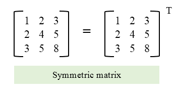


**IMPORTANT**: The symmetric matrix is equal to its transpose:

```
A = A^T
```

### Diagonal Matrix

A square matrix is called a diagonal matrix if nondiagonal entries are all zero, the main diagonal can be constants or zeros:

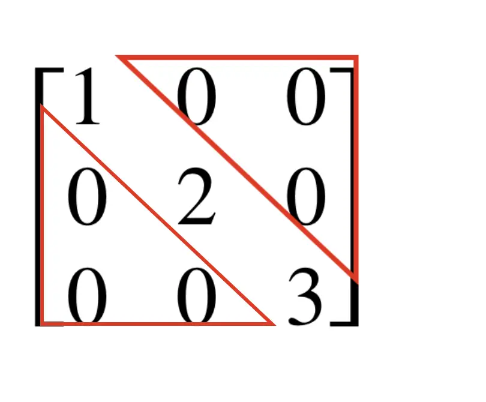

### Identity Matrix

It is a symmetric matrix where every element along the main diagonal is 1, all other elements are 0.

We usually use the `I` (upper case i) to denote this matrix and a subscript that represents the rows and columns (we just write one number since it is a square matrix):

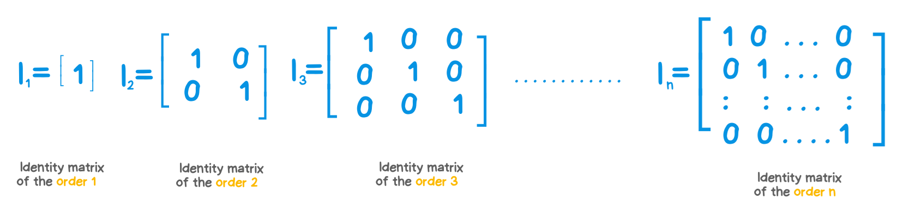

### Inverse Of A Matrix

The inverse of a matrix is another matrix that, when multiplied by the original matrix, yields the identity matrix

```
 A · B = I
 B · A = I
```

> This is the standard matrix multiplication **NOT** the hadamard product.

B is called the inverse of A and it is denoted as `A^-1`, so another way yo write the same is:

```
  A · A^-1 = I
  A^-1 · A = I
```

Not all matrices have inverses.
  - A matrix must be square (have the same number of rows and columns)
  - and be `non-singular` (its determinant must be non-zero) to have an inverse.

Let's see an example with Python:

  ```python
  >>> A = np.array([[4,-10], [3,2]])
  >>> # Let's check if the determinant is non-zero:
  >>> np.linalg.det(A)
  37.99999999999999
  >>> # let's see if this other matrix is the inverse:
  >>> AInverse = np.array([[1/19,5/19], [-3/38, 2/19]])
  >>> np.dot(A, AInverse)
  array([[1., 0.],
        [0., 1.]])
  >>>
  >>> np.dot(AInverse, A)
  array([[1., 0.],
        [0., 1.]])
  >>>
  ```

### Matrix Operations

#### Multiplication By A Scalar

`Scalars` are numbers that scale or stretch other mathematical objects without changing their direction. Scalars are NOT elements within a matrix, they are just real numbers.

When you multiply a matrix by a scalar, you simply multiply each element of the matrix by that scalar. If `A` is a matrix and `k` is a scalar, the result of multiplying `A` by `k` is denoted as `kA`.

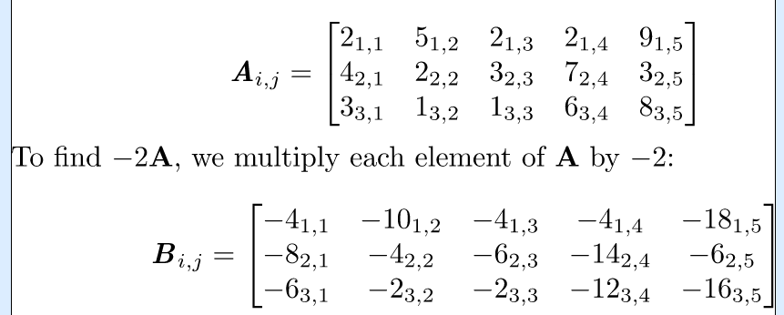

> This image was generated at http://www.tlhiv.org/ltxpreview/ with this file [matrix_multiplied_by_scalar.tex](../scripts/latex/matrix_multiplied_by_scalar.tex)

Using Numpy:

```python
>>> import numpy as np
>>> A = np.array([[2,5,2,2,9], [4,2,3,7,3], [3,1,1,6,8]])
>>> -2*A
array([[ -4, -10,  -4,  -4, -18],
       [ -8,  -4,  -6, -14,  -6],
       [ -6,  -2,  -2, -12, -16]])
>>> 
```

#### Adding And Subtracting Matrices

IMPORTANT: **ONLY** if you have two matrices of the same order you can add or subtract them.


- Addition:

  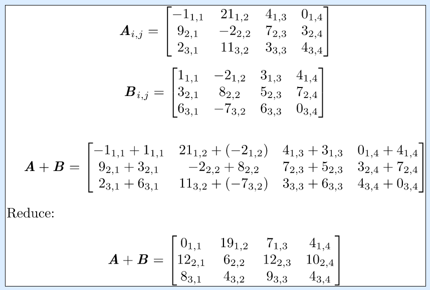

  > This image was generated at http://www.tlhiv.org/ltxpreview/ with this file [add_matrices.tex](../scripts/latex/add_matrices.tex)

- Subtraction:

  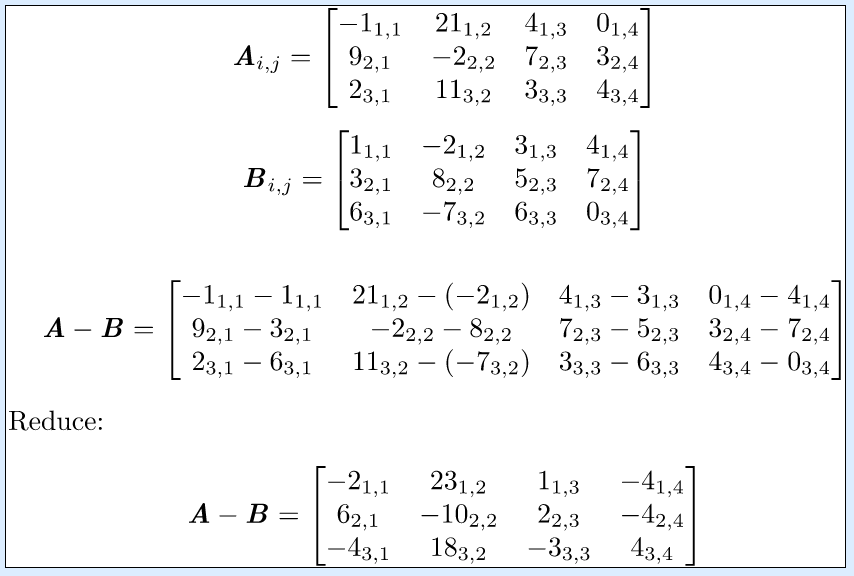

  > This image was generated at http://www.tlhiv.org/ltxpreview/ with this file [subtract_matrices.tex](../scripts/latex/subtract_matrices.tex)

#### Matrix Multiplication

**IMPORTANT**: There is a big rule for multiplying matrices and tha is the number of columns in the first matrix should be the same as te number of rows in the second matrix, in other words:

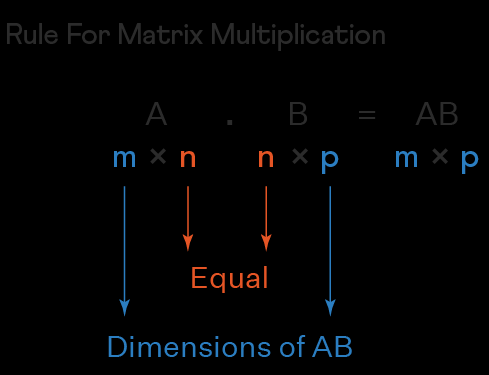

Example:


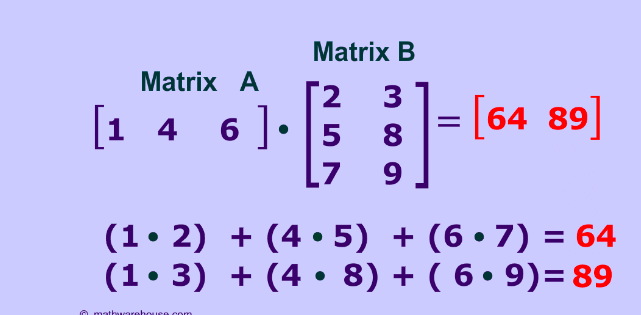

#### Hadamard Product

In mathematics, the Hadamard product (also known as the element-wise product, entrywise product[1]: ch. 5  or Schur product[2]) is a binary operation that takes in two matrices of the same dimensions and returns a matrix of the multiplied corresponding elements.

This operation can be thought as a "naive matrix multiplication" and is different from the matrix product. 

The Hadamard product A ⊙ B (sometimes A ∘ B)

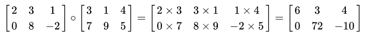

### Determinants

A determinant is a real number found in every `squared` matrix.

It is used to solve systems of linear equations.

- Find the determinant of a 2x2 matrix:

  Having this system of linear equations:

  ```
  2x+3y = 11
  4x−y = 5
  ```

  We can represent the system in a matrix:

  ```
  | 2   3 |
  | 4  -1 |
  ```

  > Determinant syntax usually uses a straight line instead of brackets.

  Now let's use this method to find the determinant:

  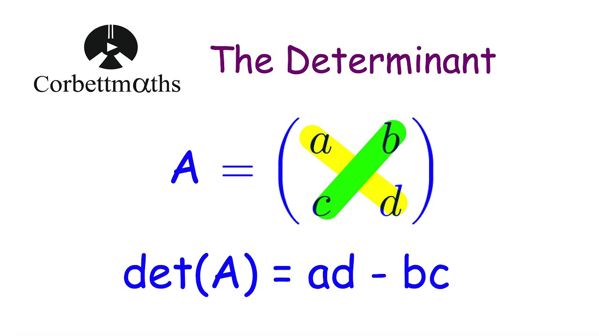

  ```
      | 2   3 |
  A = | 4  -1 |

  det(A) = (2*-1) - (3*4) = -2 - 12 = -14
  ```
- Find the determinant of a 3x3 matrix:

  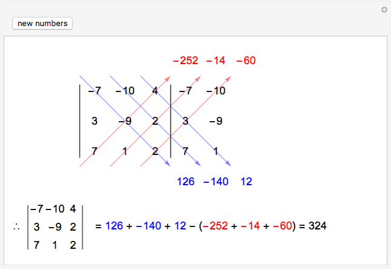

### Cramer's Rule

The cramer's rule uses determinants to solve systems of linear equations.

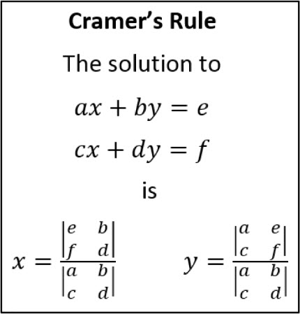

- In the image above `a`, `b`, `e`, `c`, `d` and `f` are constants.

- Basically you need to find the determinant in the numerator and divide the result by the determinant in the denominator.

Calculate the determinant using Python:

  ```python
  >>> A = np.array([[2,3], [4,-1]])
  >>> np.linalg.det(A)
  -14.000000000000004
  >>> 
  ```

### Vectors

A vector is a mathematical object that represents a quantity with both `magnitude` and `  `.

A vector may look like a 1xN matrix:

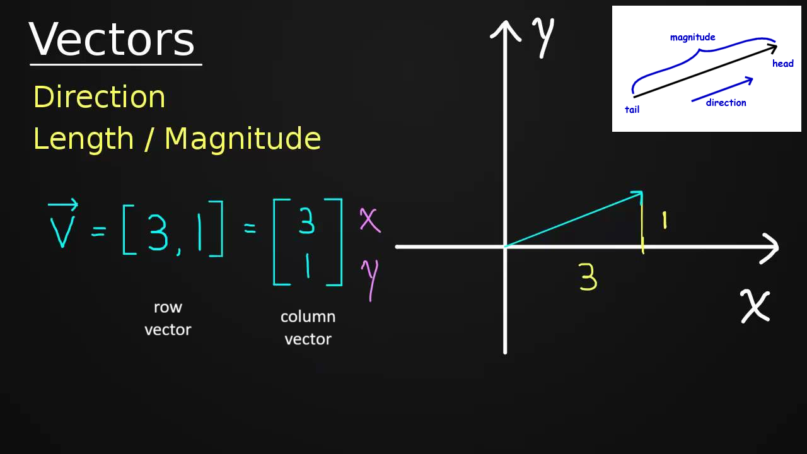


> A `unit vector` is a vector with magnitude 1. 

Vector can represent 2 dimensional object:

```
[x, y]
```

Three dimensional objects:

```
[x, y, z]
```

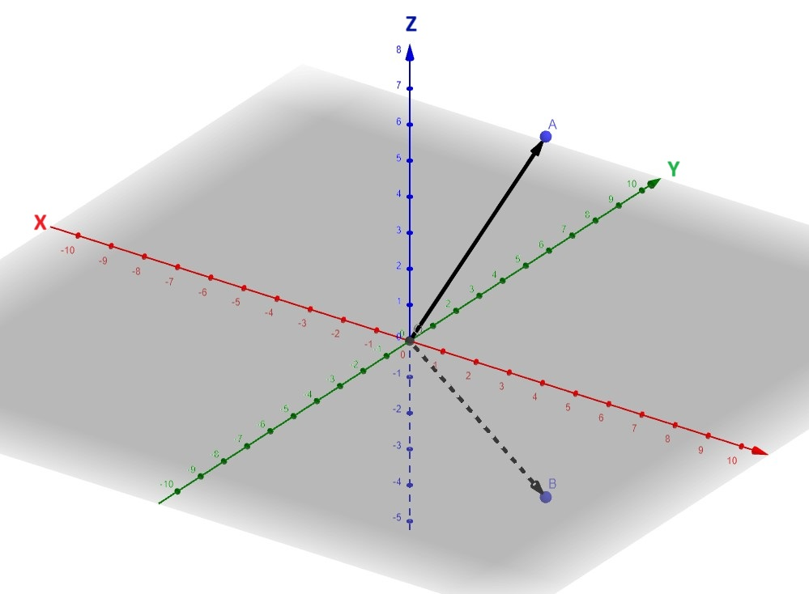


Or N dimensional objects.

#### Dot Product

The dot product of two vectors is a scalar quantity obtained by multiplying corresponding components of the vectors and then summing up these products.

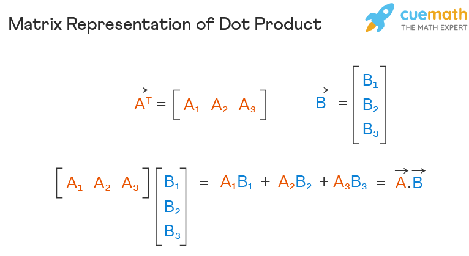

> Note: numpy use the dot method for `matrix multiplication`, for some reason they use that name but mathematically speaking, dot product is what is mentioned above.

### EigenVectors and EigenValues

**Some** matrices have associated vectors than when multiplied by the matrix they are only stretched or shrunk but not rotated. These vector are called `eigenvectors`.

The value that stretches or shrinks the vector is a scalar value called `eigenvalue`.

> Eigen is German for "typical", we could translate eigenvector to `characteristic vector`.

Eigenvectors and eigenvalues satisfy the following equation:

```
Av=λv
```

Where:

- `A` is the matrix
- `v` is the eigenvector
- `λ` lambda, it is the eigenvalue


Example:

Import Pytorch:

```python
import torch
```

> PyTorch is an open-source deep learning framework that’s known for its flexibility and ease-of-use. This is enabled in part by its compatibility with the popular Python high-level programming language favored by machine learning developers and data scientists. 

Create matrix A:

```python
A = torch.tensor([[25., 2., 9.], [5., 26., -5.], [3., 7., -1.]])
```

Calculate eigenvector and eigenvalues:

```python
eValues, eVectors = torch.linalg.eig(A)
```

In some scenarios the items are complex numbers, let's cast the values just to keep the example simple:

```python
eValues = eValues.float()
eVectors = eVectors.float()
```

Finally check if `Av=λv`:

```python
print("Av=", torch.matmul(A, eVectors[:,0]))
print("λv=", eValues[0]*eVectors[:,0])
```

> note we are multiplying only for one of the eigenvectors and one of the eigenvalues

Output:

```
Av= tensor([21.1223, 19.7798,  6.5792])
λv= tensor([21.1223, 19.7798,  6.5792])
```


Full code is available at [eigenvectors.py](../scripts/eigenvectors.py)

## Polynomials

Polynomials are mathematical expressions made up of variables and constants by using arithmetic operations like addition, subtraction, and multiplication.

### Characteristics

- In polynomials, the exponents of each of the variables should be non-negative integers.
  ```
  2x^-2        This is NOT a polynomial
  √x = x^(1/2) This is NOT a polynomial
  ```
- A polynomial comprises constants and variables, but we cannot perform division operations by a variable in polynomials.
  ```
  1/(y+2)   This is NOT a polynomial
  ```

This is how a polynomial look:

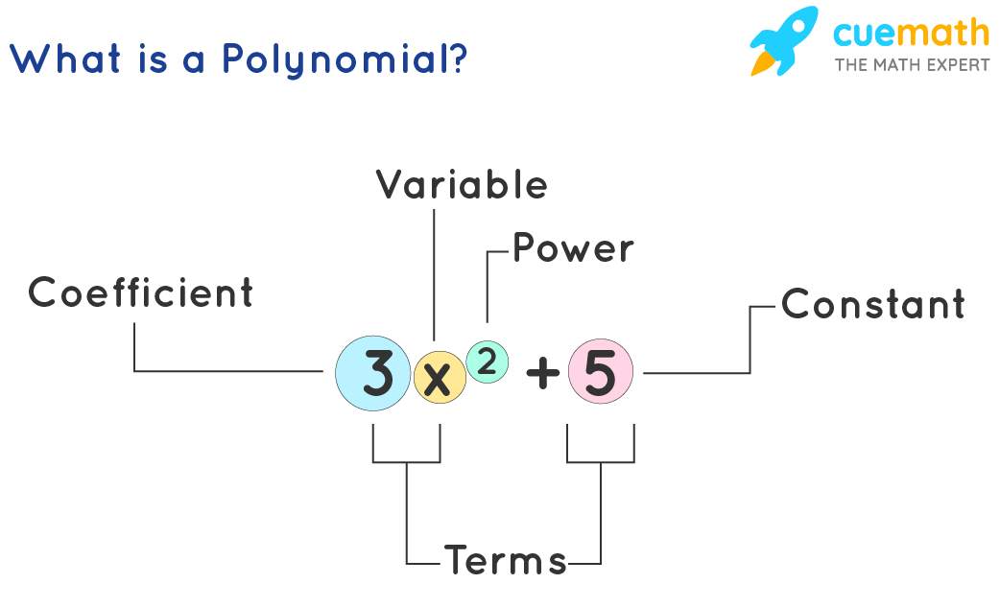

### Classification

- Classification based by number of terms:
  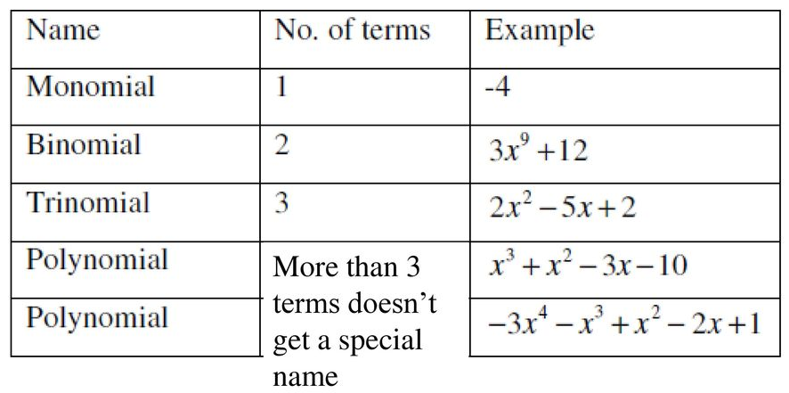
- Classification based by degree:
  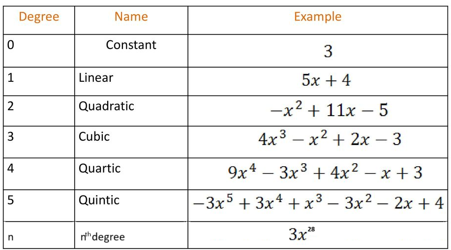
  > Note the terms are ordered from left to right based in the degree.

It is common to use both classifications at the same time (**the degree is always mentioned first**):

```
2x³ + 5x    cubic monomial
```

### Operations With Polynomials

- Addition and subtraction: You can add terms of the same variable with the same exponent by adding the coefficient:
  ```
  3x² + 7x² = 10x²
  ```
  Another example:
  ```
  2x³y⁴ - 8x³y⁴ = -6x³y⁴
  ```
  The variable and the exponent are not touch.

-  Multiplying Polynomials:
  ```
  (3x²)*(5x⁴) = 15x⁶
  ```
  > Basically apply the distributive rule and exponential rules saw in the [foundations](foundations.md) unit.
  
  Another example:
  ```
  (2x² + x)*(3x⁴) = 6x⁶ + 3x⁵
  ```

  Another example:
  ```
  (x+2)*(x+2)
  = (x+2)²
  = x² + 2x + 2x + 4
  = x² + 4x + 4
  ```

- Division:
  Similar to multiplication but this time subtract the exponents and also divide the coefficients:
  ```
  (10x⁴)/(5x²) = 2x²
  ```
  > Note: division between monomials is straight forward, we will dig more on division between polynomials with more than one term later.

- LONG DIVISION

  Polynomial long division is like the long division you do with numbers but with polynomials.

  You start by asking, "How many times does THIS go into THAT"

  Example 1:
  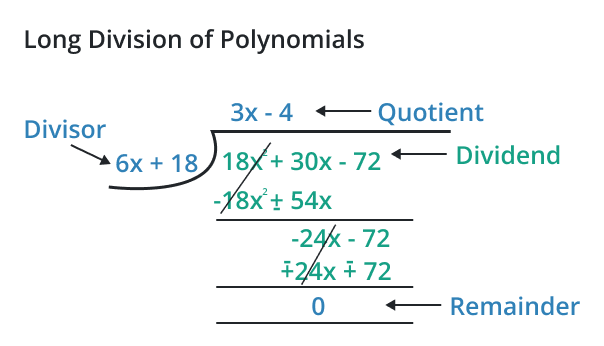

  Example 2:
  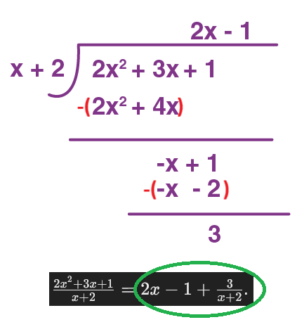

  Since there was a reminder then we can add that as a part of the result at the end `reminder/divisor`

- Synthetic Division

Synthetic division is a method that facilitates the operations of polynomials over `linear binomials` e.g. `x-c` where `c` is a constant.

This method uses the coefficients in the polynomial, example:

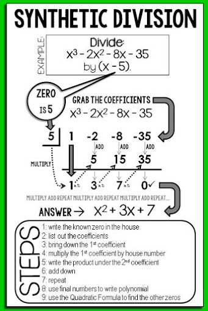

Important:

- Note the constant written in the "house" is the opposite value, in other words, the divisor is `x-5` so the value for the house needs to be `+5`
- The `known zero` refers to a value of `x` that makes the polynomial equation equal to zero, in this example `x-5` the value that makes the equation equal to zero is `+5`: `(+5)-5`.
- If the polynomial is missing a power you can add it: `0x^power`

## Factoring Polynomials

Just to remember: A factor is a number that divides evenly into a number and leaves behind no reminder, e.g. the factors of 10 are 10, 5, 2, and 1.

Factoring a polynomial means finding the smaller expressions that, when multiplied together, give you the original polynomial. 

IN SIMPLE WORDS: Factoring a polynomial means expressing it as the product of simpler polynomials, called factors.

Example:

Factor the polynomial of `6x²y³ - 12xy²`

1. Find the GCF of the coefficients, in this case the GCF of `6` and `12` is `6`.
2. Identify common variable powers. In this example both terms contains at least `one x` and at least `two y`.
3. Combine the results of #1 and #2:
  ```
  6x¹y²
  ```
  > This is the GCF for both terms. The `Greatest Common Factor (GCF) of a polynomial` is the largest monomial that divides evenly into each term.
4. Now take the original polynomial and divide EACH term **separately**  by #4:
  ```
  First term:
  (6x²y³) / 6x¹y²
  reduce:
  (6x²y³) / 6x¹y² = xy

  Second term:
  (-12xy²) / 6x¹y²
  reduce:
  (-12xy²) / 6x¹y²= -2x⁰y⁰
  = -2(1)(1)
  = -2
  ```
5. The factored result is equal to the GCF found in #3 multiplying #4:
  ```
  (6x¹y²)*(xy-2)

  or just: 6xy²*(xy-2)
  ```

## Factoring By Grouping

This technique is used when just SOME terms in a polynomial have a GCF.

Basically you will group the terms that have a GCF, then factor those groups individually.

Example:

Factor `2x³ -4x² -3x¹ +6`.

- You can see none of the coefficients have a UNIQUE common factor but we can group the terms that have a common factor:

  ```
  (2x³ -4x²) + (-3x¹ +6)
  ```

- Now find the GCF:
  - GCF for `(2x³ -4x²)` is `2x²`

- Then divide the term by that GCF:
  ```
  (2x³ -4x²) / 2x²  =  x - 2

  ∴ (2x³ -4x²) =  (2x²) * (x - 2)
  ```
- Now rewrite the polynomial:
  ```
  2x³ -4x² -3x¹ +6   =   (2x²) * (x - 2) + (-3x +6)
  You can factor the second term:
  2x³ -4x² -3x¹ +6   =   (2x²) * (x - 2) -3(x -2)
  ```
- Now `(x-2)` can be factorized:
  ```
  (2x²) * (x - 2)  -3(x -2)


  Divide by (x-2):

  (2x²) * (x - 2)  -3(x -2)
  ---------------  --------
      (x -2)        (x -2)

  =  (2x²) -3

  Multiply result by the GCF:

  (x - 2) * (2x²-3)     This is equal to the original polynomial
  ```


## Time-Saving Patterns

These are some patterns that help you factorize faster:

- `Perfect square`: it is the result of multiplying something by itself, example
  ```
  (2x)*(2x) = 4x²
  ```
  > In the example above the perfect square is `4x²`.

- `Perfect cube`:
  ```
  (3x)*(3x)*(3x) = 27x³
  ```

- `Perfect binomial square`: A perfect square binomial is a trinomial that when factored gives you the square of a binomial, example:
  ```
  4x² +8x +4 = (2x+2)²
  ```
  Test the result:
  ```
  (2x+2)*(2x+2) = 4x² +4x +4x +4
  ```
  The result of (Ax + C)² is always:
  1. first term to the power of 2
  2. 2 times the product of both terms
  3. second term to the power of 2

  Another example:

  ```
  x² -6x +9 = (x-3)²
  ```

- `Difference of perfect square`: here is a rule for this case:
  ```
  (a²-b²) = (a+b)(a-b)
  ```
  > IMPORTANT: this rule does **NOT** apply to `(a²+b²)`, the sum of perfect squares cannot be factor as easy as the difference.
  
  Example:
  ```
  x²-4 = (x+2)(x-2)
  ```
  > Note: in `x²-4` the second term `4` is the same as `2²`

  ```
  (x+2)(x-2) = x²  -2x  +2x  -4
                    ☝️  ☝️
                    ⛔  ⛔
  ```
  Another example: `5x² -125`

  We need to rewrite this binomial because `5` does NOT have a square root:

  ```
  5x² -125 = 5(x² -25)
  ```
  Now we can apply the rule:
  ```
  a² = x²
  a  = x

  b² = -25
  b  = -5

  5(x² -25) = 5[(x-5)(x+5)]
  ```
- `Difference of perfect cubes`:
  ```
  (a³ -b³) = (a-b)(a² +ab + b²)
  ```
  Example: `(8x³ -27)`\
  First find `a` and `b`:
  ```
  a = (8x³)^(1/3)
    = 2x
  
  b = (27)^(1/3)
    = 3
  ```
  Now rewrite it:
  ```
  (2x-3) [(2x)² + (3)2x + 3²]
  reduce:
  (2x-3) (4x² + 6x + 9)
  ```
- `Sum of perfect cubes`:
  ```
  (a³ + b³) = (a+b)(a² -ab + b²)
  ```
  Example: `16x³ -2y³`

  This example is a little bit tricky, because there's no cube root of 16:
  ```python
  # python
  >>> 16**(1/3)
  2.5198420997897464
  ```
  So let's start by factoring the greatest common factor:
  ```
  16x³ -2y³ = 2(8x³ -y³)
  ```
  Guess what, `8` has a cube root: `8^(1/3) = 2`
  ```
  2(8x³ -y³) = 2(apply the rule here)
  2(8x³ -y³) = 2[(2x + y)((2x)² - 2xy + y²)]
  Reduce:
  2(8x³ -y³) = 2[(2x + y)(4x² - 2xy + y²)]
  ```

## Factoring Trinomials Using Coefficients

The next techniques is used to factor trinomials whose leading coefficient is `1`:

```
x² + ax + b
```

> The leading coefficient in a polynomial is the coefficient of the term with the highest degree,

> Where `a` and `b` are constants.

> You can see the leading coefficient for `x²` is `1`.

In order to factor a trinomial like this, you need you need to find `2` numbers:

```
x² + ax + b = (x + ?₁)(x + ?₂)
```

The `sum` of these numbers must be equal to `a`

The `product` of these numbers must be equal to `b`

- Example: `x² + 6x + 8`

  You need to play and find `?₁` and `?₂`:

  ```
  x² + ax + b = (x + 2)(x + 4)
  ```

- Another example: `x² + 6x - 16`

  You need to play and find `?₁` and `?₂`:

  ```
  x² + ax + b = (x + 8)(x - 2)
  ```

  > Note one binomial has a negative sign

## Factoring By Decomposition

> If a polynomial cannot be factored is considered prime.

```
ax² + bx + c   =   ax² + (?₁ + ?₂)x + c
```

Where

```
?₁ + ?₂ = b
and
?₁ * ?₂ = ac
```

Steps:

1. Find the GCF if exist.
2. Find `?₁` and `?₂`.
3. Replace `?₁` and `?₂`
4. Distribute.
5. Factor by grouping

Example: `4x² + 23x -6`

```
?₁ + ?₂ = 23
?₁ * ?₂ = -24

∴ ?₁=24  ?₂=-1
```

Replace and distribute:

```
4x² + (24 - 1)x + -6
4x² + 24x -x + -6
```

Factor by grouping:

```
4x² + 24x -x + -6

(4x² + 24x)/(4x) = x + 6
∴ (4x² + 24x) = (4x)*(x + 6)


4x² + 24x -x + -6  =  (4x)*(x + 6) -x -6
4x² + 24x -x + -6  =  (4x)*(x + 6) -(x +6)

[(4x)*(x + 6) -(x +6)]/(x +6) = 4x -1
[(4x)*(x + 6) -(x +6)] = (x +6)(4x -1)
```

Then:
```
(x +6)(4x -1) = 4x² + 23x -6
```

Another example:

```
3x² +14x -24
= ax² + (?₁ + ?₂)x + b 
= 3x² + (?₁ + ?₂)x -24

Rules:
?₁ + ?₂ = b = 14
and
?₁ * ?₂ = ac = -72

therefore:
?₁ = -4
?₂ = 18

= 3x² + (-4 + 18)x -24
= 3x² -4x + 18x -24
= x(3x -4) + 6(3x -4) 
= (x+6)(3x -4) 

Now solve the equations:
x+6, then x = -6

3x -4, then x = 4/3

solution x=-6 or x=4/3
```

## Radicals

A radical expression looks like this:

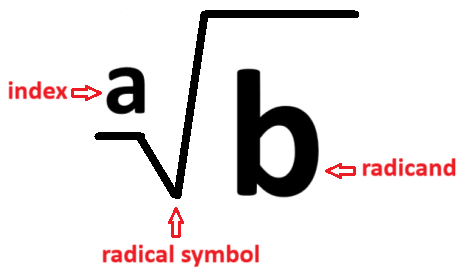

> This is read as `the ath root of b`

Radicals with index `2`, aka `square root`, are so common that usually is not written, so whenever you see a radical with no index you must assume is of index `2`.

> Just for your reference. the 3th root of b is also know as the `cube root of b`

### Rewriting Radicals

Radicals can be expressed as exponents:

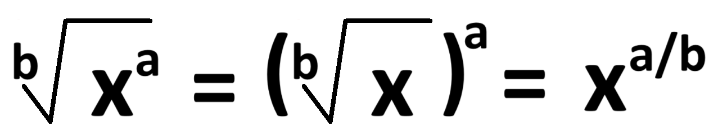

Let's see this in python:

```python
>>> from math import sqrt
>>> sqrt(25)
5.0
>>> 25**(1/2)
5.0
>>>
```

> In the script above the square root of 25 was calculated with the build in math.sqrt function and with the exponent syntax.

### Simplifying Radicals

The Nth root of a product is equal to the product of the Nth roots of each term. This property is often used in mathematics when dealing with radicals or roots. It can be expressed as:

```
√(ab) = √a * √b
```

- Let's see an example where we can use this property to simplify an expression:

  ```
  ³√16x⁴y⁶
  ```

  Let's start by factoring the radicands coefficients, we need factor to be powers of the index, `3` in this case:

  ```
  2³2 = 16
  and x³*x = x⁴
  and y⁶ = (y²)³
  ∴
  ³√16x⁴y⁶  =  ³√2³2 (x³*x) (y²)³
  ```

  Now let's move all the pieces in the radicand that have `³` in front of the radical, also remove the power:

  ```
  ³√16x⁴y⁶  =  (2xy²)(³√2x)
  ```

  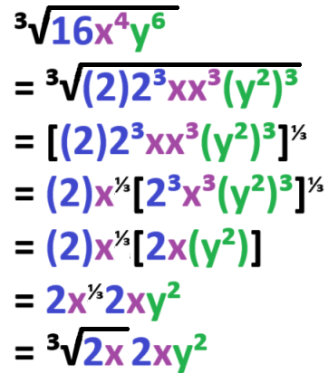

- Another Example:

```
√16x²
```

Let's find a factor for `16` so it will have a square power:

```
√4²x²
```

Now we can remove the radical symbol:

```
√16x² = |4x|      <- NOTE THE ABSOLUTE SIGNS
```

**IMPORTANT**: Wonder why the result is an absolute expression?, answer: you always want positive answers for even-powered roots, therefore the absolute signs make that.

### Radical Operations

- Addition
  ```
  √16x + √16x = 2√16x 
  ```
  
  Addition and subtraction of radicals works only if both terms have the same radicand and index.

- Subtraction

  If the terms doesn't look similar then you can rewrite the terms and see if that works:

  ```
  4√16x - √256x = ?

  rewrite second term:
    4√16x - √256x
  = 4√16x - √16²x
  = 4√16x - 16√x = -12√x
  ```

- Multiplication

  Product of matching index can be rewritten as:
  ```
  (n√x)(n√y) = n√xy
  ```

- Division

  ```
  (n√x)
  ----- = n√(x/y)
  (n√y) 
  ```

## Solving Radical Equations

When solving equations with radicals, you can often simplify the equation by raising both sides to a power that eliminates the radical. For example:

```
 ³√(2x-1) +3 = 6
 ³√(2x-1) = 6 -3
 ³√(2x-1) = 3
[³√(2x-1)]³ = 3³
   (2x-1) = 27
    2x = 27 +1
    2x = 28
     x = 28/2
     x = 14
```

In this example both side were elevate to the third power to eliminate the cube root.

This technique also works in reverse, you can cancel out exponents by adding a radical:

```
Solve 5x3 -135 = 0

5x³ -135 = 0
     5x³ = 135
      x³ = 135/5
      x³ = 27
    ³√x³ = ³√27
       x = 3
```

**IMPORTANT**: if you cancel an EVEN exponent by adding a radical with the same index then the result must have the sign `±`, example:

```
 x² = 25
√x² = √25
  x = ±5
```

### Negative Radicals

Two scenarios:

1. A radical with an `odd index` and a  `negative radicand`:

  ```
    ³√-8x³
  = (³√-8)(³√x³)
  = (³√-8)(³√x³)
  = (³√-8)x
  = (³√-2³)x
  =    -2x
  ```

  Since the exponent is an odd number is totally fine to leave it negative, because if you multiply a negative number N odd times you will always get a negative result:

  ```
  (-x)^(odd number) = negative number
  ```


2. A radical with even index and positive radicand:

```
√-16
```

In this case is hard to find a single number that when multiplied two time gives a negative number.

In this case we need to work with `IMAGINARY NUMBERS`.

The letter `i` is used to represent the radical `√-1` and is used to give a solution to problems like `√-16`.

> **Note: since `i = √-1` then `i² = -1`**

> `i` stands for imaginary.

Imaginary numbers are a subdivision of the complex numbers, we can combine Real numbers and imaginary numbers and create something called `complex` number (not so original):

```
a + bi
```

Where `a` and `b` are Real numbers.

Examples:

```
3 + 8i

or

0 + 1i    = i

or

0 + 3i    = 3i
```

#### Conjugate

Any imaginary number has a conjugate, the conjugate is equal to the imaginary number but the imaginary part has its sign changed:

```
a + bi
```

conjugate:

```
a - bi
```

> In simpler terms, the conjugate of an imaginary number is like its "reflection" over the real axis in the complex plane.


Let's use imaginary numbers to solve the exercise `√-16`:


```
  √-16
= √(-1*16)
= (√-1)(√16)
= (i)(4)
= 4i
```

One final example, resolve `i⁵`:

```
i⁵ = i² * i² * i
i⁵ = -1 * -1 * i
i⁵ = +1i
i⁵ = +i
```

## Quadratic Equations And Inequalities

### Solving by factoring

When possible, factoring a quadratic polynomial is the easiest option to solve an equation.

Steps:

1. Set the equation equal to 0 by moving all terms to one side of the equation.
2. Factor the polynomial
3. Seat each factor equal to 0, separate these equations with the word "or" since one of them could be true. This is know as `zero product property`, in simple words, if you multiply two quantities (factors in this case) and the result is 0, then at least one of the quantities is 0, therefore we need to add a `or` so at least one equation is really equal to 0.
4. Solve the equations, both solutions are solutions for the original equation.

Example:

```
x² -6x +9 = 0
```

We can use [Factoring trinomial using coefficients](#factoring-trinomials-using-coefficients) since the leading coefficient is 1:

```
  x² -6x +9 = 0

= (x + something1)(x + something2)
```

where
- `something1 + something2 = -6`
- `and something1 * something2 = 9`

Then:

```
 x² -6x +9 = 0

 = (x -3)(x -3)
```

So our equations will be:

```
x -3=0    or     x -3=0
```

Solve them:

```
x = 3     or       x = 3
```

Since both result are the same then the solution to `x² -6x +9 = 0` is `3`:

```
  x² -6x +9 = 0
3² -6(3) +9 = 0
   9 -18 +9 = 0
          0 = 0
```

> When the solution is the same for both equations it is know as `double root`.

### Completing The Square

Solve `2x² -16x +10 = 0`

1. Make the leading coefficient `1`:

```
2x² -16x +10 = 0
(2x² -16x +10)/2 = 0/2
       x² -8x +5 = 0
```

2. Move everything to the left except for the constant:

```
       x² -8x +5 = 0
          x² -8x = -5
```

3. Take the coefficient of `x¹`, in this case `-8`, dived it by `2` and square the result:

```
-8/2 = -4
Square the result: (-4)² = 16
```

4. Add the result for the previous step in both sides:

```
x² -8x +16 = -5 +16
x² -8x +16 = 11
```

5. The result can be factored using the Perfect binomial square:

> Reminder: A perfect square binomial is a trinomial that when factored gives you the square of a binomial, example

```
x² -8x +16 = 11

let's use the Perfect binomial square to factor the left side:

x² -8x +16 = (x -4)²

Now rewrite the equation:
(x -4)² = 11
```

6. We can remove the exponent `²` by adding a square radical in both sides:

```
(x -4)² = 11
√(x -4)² = ±√11
x -4 = ±√11

And at this point we can solve the equation:
x -4 = ±√11
   x = ±√11 + 4
```

Let's check our result:

```
        (x -4)² = 11
((±√11 + 4) -4)² = 11
  (±√11 + 4 -4)² = 11
         (±√11)² = 11
             11 = 11

```

### The Quadratic Formula

The quadratic formula is a handy tool for finding the solutions (roots) of a quadratic equation.

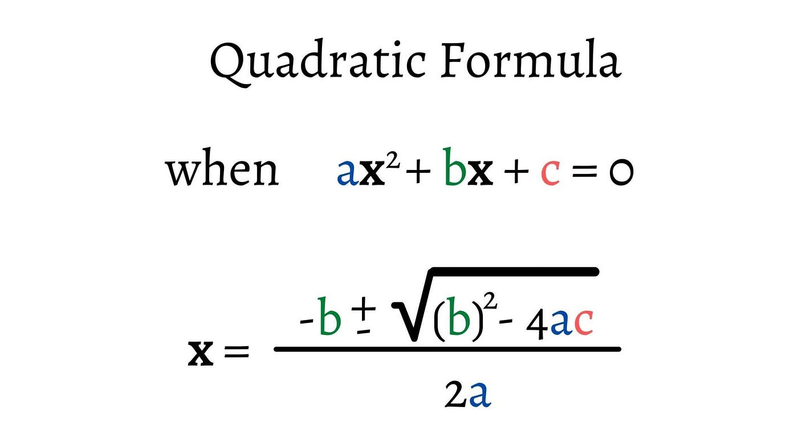

The ± symbol means you'll have two solutions:

- one where you add the square root
- and one where you subtract it.

Example:

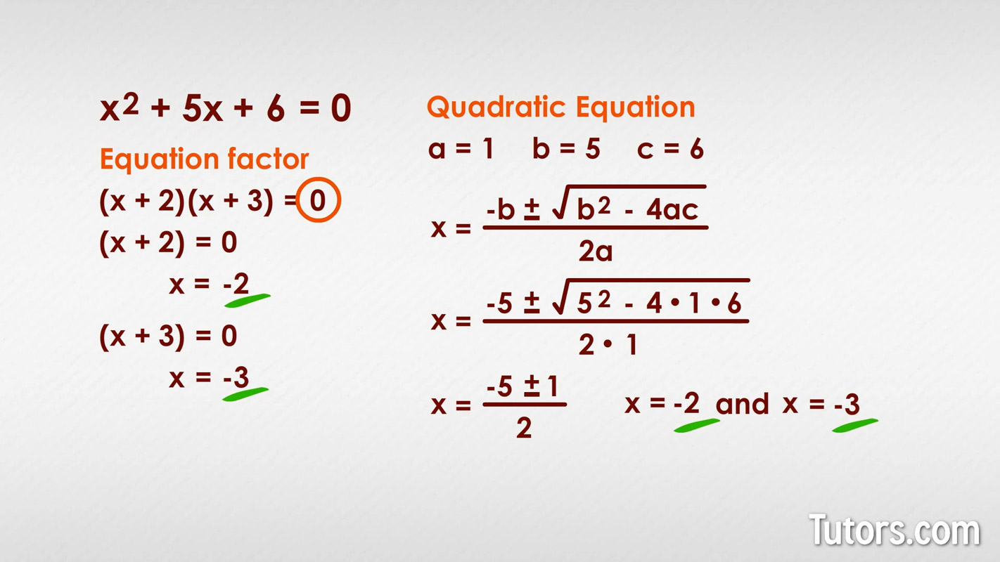

In the image above the same equation was solved using [Solving by factoring](#solving-by-factoring) on the left, and solved using the quadratic formula on the right.

#### Discriminant

The `b²-4ac` in the quadratic formula is called the `discriminant`, it determines how many solutions a given quadratic equation has.

- If the discriminant is a positive number then the equation has 2 solutions.
- If the discriminant is 0 then the equation has 1 solution (double root).
- If the discriminant is a negative number then the equation has no real solution, just two imaginary ones.

You can determine the solutions of a quadratic equation by calculating the discriminant first.

## One-variable Quadratic Inequalities

```
2x² +x -2 < 0
```

1. Pretend the inequality is an equality and solve the equation:

```
2x² +x -2 = 0

Completing the square:
    2x² +x -2 = 0
(2x² +x -2)/2 = 0/2
x² +(1/2)x -1 = 0
  x² +(1/2)x  = 1
now add half of the coefficient of the x and square it:
  x² +(1/2)x +(1/4)²  = 1
    x² +(1/2)x +1/16  = 1
    (x + 1/4)(x + 1/4)  = 1
             (x + 1/4)² = 1
            √(x + 1/4)² = ±√1
                x + 1/4 = ±1
                      x = ±1 - 1/4
Result 1:
  x₁ = +1 - 1/4
  x₁ = 3/4
Result 2:
  x₂ = -1 - 1/4
  x₂ = -5/4
```

> The result in the result are called `critical numbers`

2. The critical number will split the numbered line into `intervals`

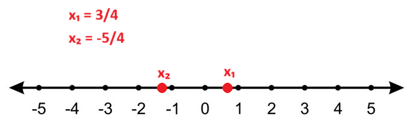

You can see the critical point divides the number line in three segments.

3. Choose one value from each segment and plug it into the original **inequality**, if the value makes the inequality true then the whole segment is part of the solution:

```
Segment 1:
2(-4)² +(-4) -2 < 0
             26 < 0

Segment 2:
2(-1)² +(-1) -2 < 0
             -1 < 0

Segment 3:
2(2)² +(2) -2 < 0
             8 < 0
```

The only segment that makes the inequality true is the second segment.

> Note `x₁` and  `x₂` are solid circles in the graph, which mean they are part of the solution.

Solution:

-5/4≤ x ≤ 3/4

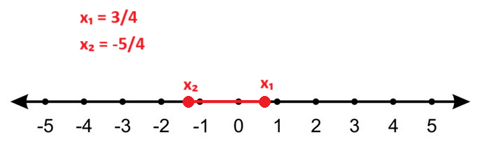

## High Powered Equations


```
x³ -6x² +5x +12
```

Finding factors, demonstrate `x-3` is factor of the equation above:

```

3 |   1   -6   5   12
---
           3  -9   -12
      ----------------
      1   -3   -4   0


∴
x³ -6x² +5x +12 = (x-3)(x² -3x -4)
Perfect binomial square:
                = (x-3)(x-4)(x+1)
```

To solve the equation (x−3)(x−4)(x+1)=0(x−3)(x−4)(x+1)=0, you can set each factor equal to zero and solve for xx.

- Set `x−3=0` and solve for `x`. This gives you one solution, `x=3`.
- Set `x−4=0` and solve for `x`. This gives you another solution, `x=4`.
- Set `x+1=0` and solve for `x`. This gives you the third solution, `x=−1`.


superscript: ⁰¹²³⁴⁵⁶⁷⁸⁹
subscript: ₀₁₂₃₄₅₆₇₈₉
