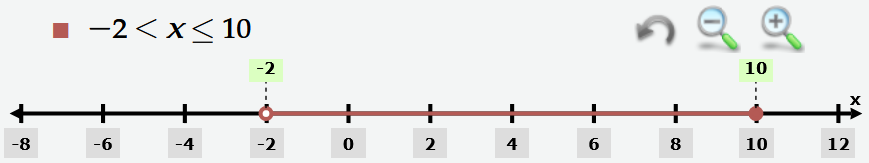

# Algebra

## Recommended Books

- [The complete idiots guide to algebra](../books/the-complete-idiots-guide-to-algebra.pdf) By W. Michael Kelley https://igcsestudybank.weebly.com/uploads/5/2/0/3/52038731/the-complete-idiots-guide-to-algebra.pdf

Tip: if you use firefox to open PDFs you can add this CSS style to invert the colors of the pdf:
```
.pdfViewer {
  filter: invert(1);
}
```

## What Is Algebra

Algebra is a branch of mathematics where letters and symbols represent numbers and quantities in equations and expressions


## Equations and Inequalities

An **equation** in algebra is a mathematical statement that shows that two expressions are equal.

Example:

```
2w+5=11,
```

In this example `w` represents an unknown value.

Solving the equation implies finding the value of `w` so the equation remains true. For the example above the answer is `w=3`. You can confirm this result by substituting the result in the equation and check if the equality remains true:

```
2(3)+5=11
   6+5=11
    11=11
```

We have confirmed `3` is the right number that keeps the balance (equality).

Now, how do you find the value of `w`?, that's what we are going to study in this section.

### Solving An Equation

In orders to solve an equation you have to isolate the variable on one side of the equal sign so you can have the actual value on the other side.

You can play with the equation and add, subtract, divide, multiply, etc. values to the equation to isolate the variable, but you need to keep the balance at any point, that means if you want to subtract `-5` of one side, then you MUST do it in both side to keep the balance (equality):

```
2w+5 = 11

Let's subtract -5:
2w+5-5 = 11-5

Simplify:
2w = 6

Now let's remove that 2 by dividing by 2:
2w/2 = 6/2

Simplify:
w = 3

THE ANSWER IS 3 OH YEAH!!!
```

You can replace `3` in the original equation `2w+5 = 11` and see if the result is `11`, if true then `3` is in fact the right answer.

Sometimes adding an operation in both sides can be pretty obvious, some people like to save some lines by just writing the next expression that keeps the equation in balance:

```
2w+5 = 11

Let's subtract -5:
2w = 11-5      You can see I directly removed +5
Some people go further and directly reduce 11-5:

2w = 6

Finally divide by 2:
w = 3           This time I simplified 6/2 directly
```

You can do this as long as you keep your process readable, sometimes making things clears is better than writing less.

> To remember: that `2` attached to `2w` is called **coefficient** and it represents a multiplication, this time `2 times w`.

Another example:

In this exaple the variable is `k`:

```
                -k/6+4 = 28

Start by the easy tasks:
remove that +4:   -k/6 = 24   I subtracted -4
remove that 1/6:    -k = 144  I multiplied by 6 in both sides

Now finally multiply by -1 so k will be positive:
                     k = -144
```

> Note: in this example the coefficient attached to `k` was a fractional coefficient, `1/6` to be precised. `(1/6)*k` is the same as `k/6`.

Let's check if our result is right:

```
                -k/6+4 = 28
           -(-144)/6+4 = 28
               144/6+4 = 28
                  24+4 = 28
                    28 = 28

                  OH YEAH!!!!
```

Another example:

```
                x + 3 = 5 + 3
        In this case we can directly cancel +3:
                    x = 5
        Why? because it is the same as:
                x+3-3 = 5+3-3
````

So if you find the same `terms` in both sides then you can directly cancel them.

Another example:

```
–3x – 21 = –2x + 7
     -3x = -2x + 7 + 21
     -3x = -2x + 28
-3x + 2x = 28
      -x = 28
      x = -28
```

Test the result:

```
    –3x – 21 = –2x + 7
-3(-28) - 21 = -2(-28) + 7
     84 - 21 = 56 + 7
          63 = 63

         OH YEAH!!
```

### SymPy

SymPy is a Python library for symbolic math. 

Learn more at: https://www.sympy.org/en/index.html

In symbolic math, symbols are used to represent mathematical expressions.

You can find practical examples at: https://problemsolvingwithpython.com/10-Symbolic-Math/10.00-Introduction/

- Install sympy: `pip install sympy`

Let's solve the same equation we solve in the previous section:

```
    –3x – 21 = –2x + 7
```

Python code:

```python
from sympy import symbols, Eq, solve

# Define the variable
x = symbols('x')

# Define la equation
equation = Eq(-3*x - 21, -2*x + 7)

# Solve the equation
solution = solve(equation, x)

print(f"The solution for {equation} is {solution}")
```

> This code is also available at [solving_equations.py](../scripts/solving_equations.py).


Execution:

```
$ python3 solving_equations.py
The solution for Eq(-3*x - 21, 7 - 2*x) is [-28]
```

Just a note, in an IPython console session, or a regular Python session, it will use the Unicode pretty printer if the terminal supports Unicode:

```
$ python3
Python 3.10.12 (main, Nov 20 2023, 15:14:05) [GCC 11.4.0] on linux
Type "help", "copyright", "credits" or "license" for more information.
>>> from sympy import *
>>> x,y,z = symbols('x y z')
>>> init_printing()
>>> Integral(sqrt(1/x), x)
 ⌠
⎮     ___
⎮    ╱ 1
⎮   ╱  ─  dx
⎮ ╲╱   x
⌡
>>>
```

Learn more at https://docs.sympy.org/latest/tutorials/intro-tutorial/printing.html


### Absolute Value Equations

Steps:

1. Isolate the absolute expression.
2. Create two equations, both equations will look like the isolated version but without the bars, the second equation will change the value on the left for its opposite value.
3. Solve the equation, both equations are the answer for the original absolute equation.

Example:

```
20|3x-3| = 20

Dived by 20:
  |3x-3| = 1

Now create two equations:
3x-3 = 1    and   3x-3 = -1

Solve both equations:
3x-3 = 1    and   3x-3 = -1
  3x = 1+3          3x = -1+3
  3x = 4            3x = 2
   x = 4/3           x = 2/3
```

Solution using python here [absolute_equations.py](../scripts/absolute_equations.py).

Let's verify the answers:

```
For x = 4/3
            20|3x-3| = 20
        20|3(4/3)-3| = 20
        20|(12/3)-3| = 20
             20|4-3| = 20
               20|1| = 20
                  20 = 20

For x = 2/3
            20|3x-3| = 20
        20|3(2/3)-3| = 20
         20|(6/3)-3| = 20
             20|2-3| = 20
              20|-1| = 20
                  20 = 20
```

## Equations with Multiple Variables

```
5x-4 = 0
```

If I tell you `solve the equation above for x` then you already know you need to isolate x to find its value.
This is pretty obvious because `x` is the only variable in the equation.

What if the equation has more that one variable:

```
3(w + 4x) -10 = 6x + 7

```

In this case you need to carefully read what you are asked for: `solve the equation for 'y'`, since the sentence is saying `for 'y'` then you have enough to solve the equation, you just need to isolate y in one side of the equation:

```
3(w + 4x) -10 = 6x + 7

first simplify:
3w + 12x -10 = 6x + 7

Now move things to the right:
    3w + 12x = 6x + 7 + 10
    3w + 12x = 6x + 17
          3w = 6x - 12x + 17
          3w = -6x + 17
           w = (-6x + 17)3
This can be reduced even more using fractions with the same denominator:
           w = (-6x)/3 + 17/3
           w = -2x + 17/3
```

There you go, you have solved the equation for `y`, the result may look a little weird but it is still valid.

## The Coordinate Plane

The coordinate plane, also known as the `Cartesian plane`, is a two-dimensional plane formed by two perpendicular number lines called the `x-axis` (the horizontal line) and the `y-axis` (the vertical line). These axes intersect at a point called the `origin`, usually denoted as `(0, 0)`.

Coordinates on the plane are written in the form `(x, y)`, where 'x' represents the horizontal position (along the x-axis) and 'y' represents the vertical position (along the y-axis). The x-coordinate tells you how far to move horizontally from the origin, while the y-coordinate tells you how far to move vertically from the origin.

`(x,y)`: These numbers are known as the `abscissa` (for x) and the `ordinate` (for y). So, what do they represent?


The intersection of the two axes at the origin creates a cross shape, with four spaces of equal size around the axes. These spaces are called quadrants.

Learn more at: https://www.twinkl.com.mx/teaching-wiki/cartesian-plane

Could you tell me the coordinates (the values for x and y) to find the start?:


Answer: the coordinates are `(2,4)`, this means 2 positive units in the x-axis and 4 positive units in the y-axis.

### Sketching Equations

Let's say we have this equation:

```
x+y = 9
```

If tell you to solve it for `x` then the answers is `x = 9-y` and if I tell you solve it for `y` then the answer is `y = 9-x`, but what if I told you I need both the values for `x` and `y` that makes the equation true (9), then we have infinite answers:

```
1+8 = 9
2+7 = 9
0+9 = 9
3.5+5.5 = 9
etc...
```

What if you put those values in the cartesian plane:

```
point 1: (1, 8)
point 2: (2, 7)
point 3: (9,0)
point 4: (3.5, 5.5)
```

Graph:


The spot where the line intersects the x- or -axis is called `intercept`. Using these spots are a practical way to draw the equation, therefore you only need to find (0,y) and (0,y):

```
Find y in (0,y):
  0=9-y ∴ y=9
Finally: (0,9) intersects in y

Find x in (x,0):
  x=9-0 ∴ x=9
Finally: (9,0) intersects in x
```

> `∴` means therefore in math.

You can see all dots make a perfect `straight line`, this line represent the infinite number of solutions for `x+y=9`, every single point on that line is a solution for the `linear equation`, it is called linear because it makes a straight line.

> Sketching an equations is useful to visualize the all the ordered pairs (x,y) that conforms the equation.

## Linear Equations

The standard form of a linear equation is:

```
Ax + By = C
```

> Sometimes the equation is written different but it keeps the same characteristics.

Where:

- `A` and `B` represent coefficients.
- `C` is a constant.

Characteristics of linear equations:

- Variables are raised to a power no higher than one.
- They make a straight line graph.

An example worth to review:

- `x = 5.5`, yes, it is a linear equation, it may help to see it in another form just to understand why: `1x + 0y = 5.5`, reduce the equation and you will find why it is still a linear equation, this is the graph:

  
  
  Why the line is vertical this time?, answer: because all possible value for `y` are converted to 0 since the equation has `0y`, so in `(x,y)` the variable responsible to make the equation `5.5` will be `x` and `y` can have any value, in other words: `(5.5,y)` where `x` is fixed and `y` have infinite values therefore making a vertical line.

You can find online graphing calculators so you can visualize your equations, example: https://www.desmos.com/calculator

Another example:

```
-3x+y = 8
```

First let's solve the equation for `y`:

```
y = 3x +8
```

> When `y` is isolated is called the `slope-intercept` form.

Now it is easier to find some (x,y) pairs:

> You can take as many values for `x` as you want, at least two value are needed since you need to make a line.

|x-axis|y-axis|
|---|---|
|1|y=3(1)+8=11|
|2|y=3(2)+8=14|
|3|y=3(3)+8=17|
|4|y=3(4)+8=20|
|5|y=3(5)+8=23|

Now let't plot this points:


> Image above was generated using https://www.desmos.com/calculator

Using this chart you can find other valid values like (-2,2)
.

## How To Find The Slope

The slope describes how slanty a line is.


This is the slope formula, which states `Slope = Rise/Run`. When plotting a line on a graph, the `Rise` refers to the change in `y` that corresponds to a specific change in `x`. This change in `x` is called the `Run`.

In the image above the first spot is found at `(3,2)` where `3 is x₁` and `2 is y₁` and the second one is at `(7,5)` where `7 is x₂` and `5 is y₂`, let's find the slope of this line:

```
        5-2   3
slope = --- = -
        7-3   4
```

### What The Slope Tells You

- What does `3/4` means?: it means you can go up 3 units and right 4 units and you will be still in the line

- Positive slopes means the line rises up (negative slopes means the line fall)

- An slope equals to 0 means the line is horizontal.

- Undefined slopes (where x₂ and x₁ are the same therefore making a division by 0 in the equation) means the line is vertical.

- Slopes close to 0 mean that the line rise/falls slowly

- Slopes far from 0 mean that the line rise/falls quickly.


## Absolute Value Graphs

Consider the following equation:

```
|x|-y = -9
```

Let's solve for `y`:

```
|x|+9 = y
```

Let's create a table for some spots:

|x-axis|y-axis|y-axis(simplified)|
|---|---|---|
|-3| |-3|+9 = y | 12|
|-2| |-2|+9 = y | 11|
|-1| |-1|+9 = y | 10|
|0| |0|+9 = y | 9|
|1| |1|+9 = y | 10|
|2| |1|+9 = y | 11|
|3| |1|+9 = y | 12|

You can see we can take all [Real](foundations.md#classifying-number-sets) numbers (all negatives and all positives), but the result for `y` is always a positive number.

Let's plot this spots:


As you can see by the chart, equations with absolute expressions generate a V-shape chart.

>💡 The sharp point is called `vertex`

**Is the absolute value function a linear function?**, have fun and try to find the answer: https://math.stackexchange.com/questions/88669/is-the-absolute-value-function-a-linear-function

It does not have a constant slope. Therefore, it is not a linear function, but you can have some fun discussing with others about this.

### More About Absolute Value Graphs

In the image below you can see how operations affect an absolute value graph:


- Red line `|x| = y` shows a basic graph, calculate the slope taking two spots: `(5/2)/(5-2) = 1`, which means (and also is visible) the slope is at 45 degrees.

- Blue line `-|x|-2 = y` shows and inverted graph in the x-axis because the abs term is being multiplied by `-1` and it is move `2` units down in the y-axis because `-2` is being subtracted.

- Green line `3|x|+1 = y` shows a thin graph because is being multiplied by `3`, which means the line will rise quickly, and finally is moved `1` unit up in the y-axis because `+1` is being added.

- Purple line `|(1/4)|x|-5 = y` shows a thick graph because the absolute term is being divided by `4` and it is moved `5` units down in the y-axis because `-5` is being subtracted.

## Point-Slope Form

So far we have seen the `standard form` of a linear equation:

```
Ax + By = C
```

Where:

- `A`, `B` and `C` are constants (numbers).
- `x` is the value for the x-axis
- `y` the value for the y-axis.

> Other author use different letters but it is the same.

> TIP: if you have an equation that uses the standard form you can find the slope using this formula: `Ax + By = C  ∴  m=A/B`, this is because you have to send `Ax` to the right side and the dived by `B` to isolate `y`.

And we have seen the `slope-intercept` form:

```
y = mx +b

Example:
-3x+y = 8  👈 standard equation
y = 3x +8  👈 slope-intercept equation
```

Where:
- `m` is the slope
- `b` is the intercept in the y-axis


But now we are going to see another way to represent linear equations, the `point-slope` form:

```
y-y₁ = m(x-x₁)
```

Where:

- `m` is the slope
- `y` is the y coordinate of any point
- `y₁` is the y coordinate of an known point.
- `x` is the x coordinate of any point
- `x₁` is the x coordinate of an known point.

Let's see a practical example:

Having the equation `x=y` transform the equation into its point-slope form:


- Find the slope: `m=(y₂-y₁)/(x₂-x₁)`, from the image I will pick these spots `(5,5)` and `(1.5, 1.5)`, then the slope is `m=(5-1.5)/(5-1.5) =1`, so the slope is `m=1`.
- Now let's add that slope to the formula: `y-y₁ = 1(x-x₁)`, and there you go, now you have created the point-slope form of the equation `|x|=y`..

What if I want to have a point-slop formula of a linear equation that rise twice as fast than `|x|=y`?, then you only need to modify the slope: `y-y₁ = 2(x-x₁)`, let's use this last form and see the graph:


You can see the the line rises 2 times faster, e.g. for 5 in x we have 10 in y.

Now, let's go further, I will give you one spot and the corresponding slope of the line, then I want you to give me the point-slope form and finally the general equation:

Spot: (5,10)\
Slope: 2

```
  y-y₁ = m(x-x₁)
  
  y-10 = 2(x-5)   👈 Point-slope form
  
  y-10 = 2x-10
  y = 2x          👈 standard equation
```

Guess what, you have found the same exercise we saw earlier (the green line):


💡 So you can find the standard equation if you have the slope and any point of the line using the point-slope formula.

## From Point A To Point B

Using the slope formula, find the linear equation giving two points:

```
Point A: (3,2)

Point B: (6, 4)
```

Procedure:

```
    y₂-y₁
m = -----
    x₂-x₁

    4-2     2
m = ---  =  -
    6-3     3
```

since we have two points and the slope, we can use the `point-slope` formula:


```
y-y₁ = m(x-x₁)

I will use this point: (3,2), now let's replace the slope and the point:
y-2 = (2/3)(x-3)
```

Now we can reduce and move things around to get the `slope-intercept` form:

```
y-2 = (2/3)(x-3)

Reduced:

y-2 = (2/3)(x-3)
y-2 = (2/3)x - (2/3)3
y-2 = (2/3)x - (6/3)
y-2 = (2/3)x - 2
  y = (2/3)x - 2 + 2
  y = (2/3)x +0     👈 intercept in y-axis is in 0
```

Let's use a graphical calculator:


There you go.

## Parallel And Perpendicular Lines


Examples:


> For perpendicular lines: `m₁*m₂ = -1`, in other words: the result of the product of both slope is `-1`.

## Linear Inequalities

An inequality is a statement that shows the relationship between two quantities.

Expressing that one quantity is `greater than`, `less than`, or not equal to the other.


> Note: the symbol `≠` (not equal to) is not really helpful to describe why something is not equal, instead `>, <, ≥, ≤` are preferred because they explay why the quantities are unequal.

For example

- `x > 5` means that the value of `x` is greater than `5`
- `y ≤ 10` means that the value of `y` is less than or equal to `10`.
- `10 ≥ 6` means `10` is either greater or equal to `6` which is true.
- `10 ≥ 10` means `10` is either greater or equal to `10` which is true (kinda obvious).

You may be tested to say if an statement is `true` or `false`:

- `10 ≥ 5000`, this is `false`, `10` is not greater or equal than `5000`

**IMPORTANT**: an equation has one unique solution but inequalities have a `range` of solutions, e.g. `x > 5` here there are a lot of numbers for `x` that satisfy this statement.

### Negative Number

Large negative numbers are considered the smallest quantities, for example, all these statements are true:

- `-6000 < 50`
- `-6000 < 1`
- `-6000 < 0`
- `-6000 < -3`
- `-6000 < -5999`

### Solving Inequalities

Solving inequalities involves finding all the values that makes the statement true.

Example:

`2x > 10`, answer: all values greater than 5 make the statement true.

How I found the answer?, isolating the variable:

```
  2x > 10

Divide by 2 in both sides:
2x/2 > 10/2

Reduce:
  x > 5
```

Let's see the graph for `2x > 10`:


> You can use https://www.desmos.com/calculator to generate this graph.

Sometimes a number line is preferred since the y-axis is not needed:


When using number a `filled circle` usually indicates that the endpoint is included in the solution set, in the image above an `open circle` means `5` is not included in the solution set, in other words, `5` is not a valid option, only values greater than `5`.

> Image above was generated using https://quickmath.com/webMathematica3/quickmath/graphs/inequalities/basic.jsp#c=solve&v1=2x%253E10


**IMPORTANT**: If you ever need to **multiply** or **divide** by a **negative** number you MUST **reverse** the inequality sign.

Example:

```
   -3x > 12

Divide by -3 AND REVERSE THE SIGN:
-3x/-3 < 12/-3

Reduce
     x < -4
```

Test the result:

> Use eny number less than `-4` (tip: `-4` is not an option because it is not less than `-4`, it is equal)

```
   -3x > 12
-3(-5) > 12
    15 > 12
```

Reversing the sign of an inequality is called the inequality `mood swing.`

### Compound Inequalities

Compound inequalities are statements that express two inequalities:

```
-2 < x ≤ 10
```

Statement above is read as "-2 is less than x, which is greater than 10"



> To remember: `≥` and `≤` signs are inclusive, so you will see a filled circle.

> Image above was generated here: https://quickmath.com/webMathematica3/quickmath/graphs/inequalities/basic.jsp#c=solve&v1=-2%253Cx%255Cle10

#### Solving Compound Inequalities

Compound inequalities have three parts, in order to isolate a variable you have to apply an operation in al three parts:

```
   -16   <     2x + 4    <   24

Subtract -4:
-16 -4   <   2x + 4 -4   <   24 -4

Reduce
   -20   <      2x       <   20
  
Divide by 2:
  -20/2  <      2x/2     <   20/2

Reduce
    -10  <        x      <   10   ANSWER
```


> https://quickmath.com/webMathematica3/quickmath/graphs/inequalities/basic.jsp#c=solve&v1=-16%253C2x%2B4%253C24


**IMPORTANT**: If you ever need to **multiply** or **divide** by a **negative** number you **MUST reverse BOTH** signs.

### Inequalities With Absolute Values

Inequalities with absolute values are solve differently if the sentence has a `greater than` or `less than` sign:

When the inequality has the symbol `less than` (<), what we are looking for is to find the range of values of x that make the statement true:

```
|x-3| < 10
```

Solve it for `x`:

```
Rewrite the statement as a compound inequality, change the sign in the left of the statement:
-10 < x-3 < 10

Now solve the compound inequality:
-10 < x-3 < 10
-10+3 < x < 10+3
-7 < x < 13
```

The solution is the resulting compound inequality:


> See graph above at https://quickmath.com/webMathematica3/quickmath/graphs/inequalities/basic.jsp#c=solve&v1=%257Cx-3%257C%253C10

When the inequality has the symbol `greater than` (>), there are typically parts of the number line for x that are discarded, so we use "or" to indicate that the solution can be in one part or another of the number line:

```
|2x + 3| > 5

Create two inequalities and solve them:
2x + 3 > 5                                 -(2x + 3) > 5
    2x > 5 -3                                 -2x -3 > 5
    2x > 2                                       -2x > 5 + 3
  2x/2 > 2/2                                     -2x > 8
     x > 1        I REVERSED THE SIGN HERE👉  -2x/-2 > 8/-2
                                                   x < -4

Now combine the answers with and OR:

x > 1 or x < -4
```

Let's see the graph:


> See graph above at https://quickmath.com/webMathematica3/quickmath/graphs/inequalities/basic.jsp#c=solve&v1=%257C2x%2B3%257C%253E5

You can see by the graph tha using an `or` is required since there's a section in the number line that we want to exclude, this part are numbers that does NOT make the expression greater than the value.

## Systems Of Equations

Toretto is chasing an assassin.

- The assassin is going at A `150 km/h`, sor `2.5 km/min`
- Toretto is going at `180 km/h`, or`3 km/h` and started to run `5 min later`.

**How long will it take Toretto to catch up with the assassin?**

Equation the assassin:

```
m = 2.5
point = (0,0)

Using point-slope form:
y-y₁ = m(x-x₁)
y-0 = 2.5(x-0)
y = 2.5x
```

Equation for Toretto:

```
m = 3
point = (5,0)    5 in x-axis because it started 5 minutes later

Using point-slope form:
y-y₁ = m(x-x₁)
y-0 = 3(x-5)
y = 3x-15
```

Let's see the graph for both equations:


> Red line is Toretto and blue line is the assassin.

Now let's put together both equations:

```
  3x-15 = 2.5x
Reduce:
      3x = 2.5x +15
3x -2.5x = +15
    0.5x = 15
       x = 15/0.5
       x = 30
```

Answer: Toretto is going to catch up to the assassin in `30` minutes.

If you want to know the green spot in the chart then:

```
   3x-15 = y
3(30)-15 = y
   90-15 = y
      dd q q75 = y
```

So there you have it: `(30, 75)` is the interception of both equations.


Systems of Linear Equations and Matrices
    Quadratic Equations and Functions
    Polynomials and Polynomial Functions
    Rational Expressions and Equations
    Exponential and Logarithmic Functions
    Radical Equations and Functions
    Conic Sections
    Sequences and Series
    Complex Numbers
    Matrices and Determinants
    Vectors
    Vector Spaces
    Linear Transformations
    Eigenvalues and Eigenvectors
    Polynomial Interpolation
    Factorization Techniques
    Group Theory
    Ring Theory
    Field Theory