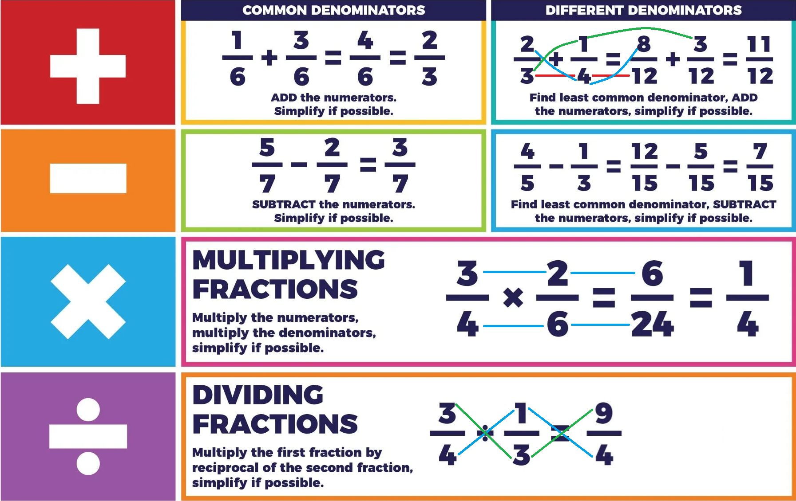
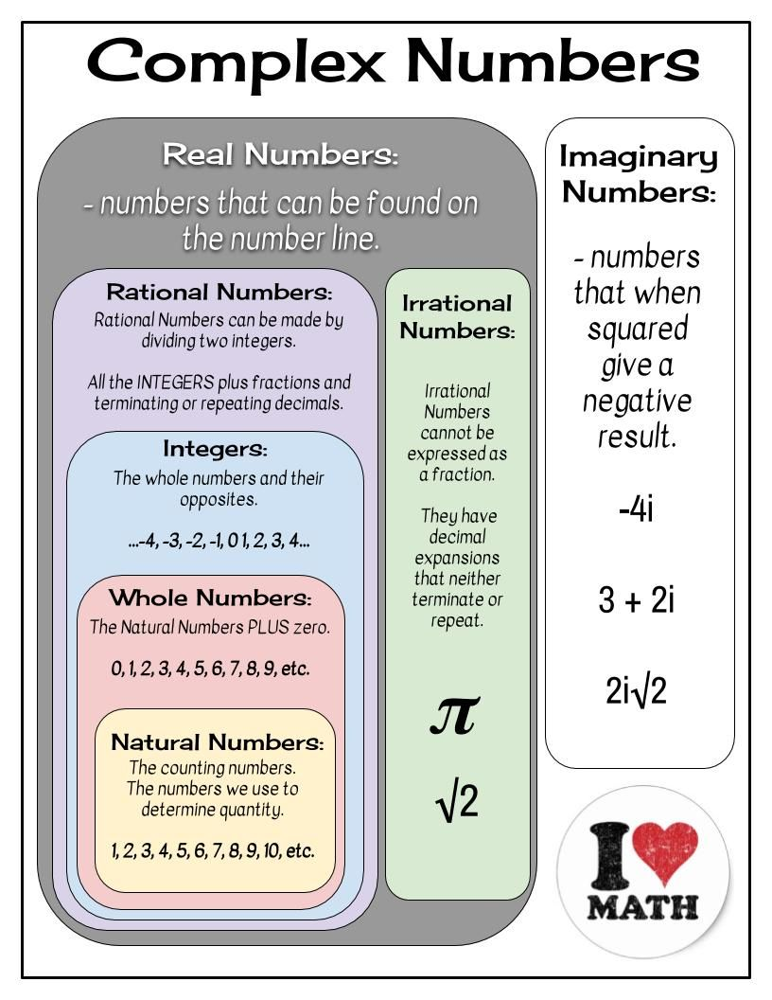
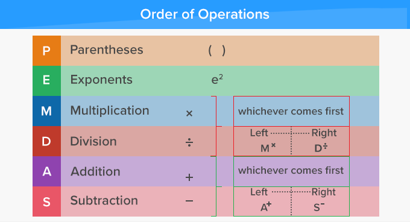
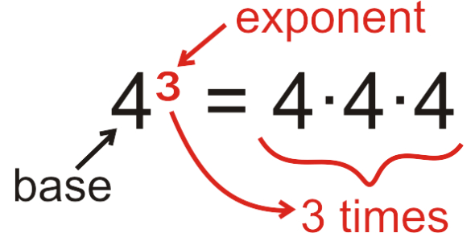

# Foundations

## Recommended Books

- [The complete idiots guide to algebra](../books/the-complete-idiots-guide-to-algebra.pdf) (Part 1) By W. Michael Kelley https://igcsestudybank.weebly.com/uploads/5/2/0/3/52038731/the-complete-idiots-guide-to-algebra.pdf

## Jargon

- Factor: A factor is a number that divides evenly into a  number and leaves behind no reminder, e.g. the factors of 10 are 10, 5, 2, and 1.
- Reciprocal: every number has a reciprocal, that is the fraction 1 over that number, example the reciprocal of 6 is 1/6.

## Working With Fractions

In case you need to remember it: The top of a fraction is called `numerator` and the bottom part is called `denominator`.

### Common Denominator

- Least Common Denominator (LCD): The smallest whole number that is multiple of two or more whole numbers:
    ```
    Having 3/4 and 7/16 find the LCD

    multiples of 4: 4, 8, 12, 16, ...
                 *  1  2   3   4
    multiples of 16: 16, 32, 48, ...
                  *   1   2   3

    Then 16 is the LCD for 4 and 16.
    ```
    We can use the LCD if we want two fractions look similar:
    ```
    3   4   12
    - * - = -
    4   4   16
    ```
    So now we have these fractions:
    ```
    12            7
    -     and     -
    16            16
    ```
- Greatest Common Factor (GCF): The largest number that is a common divisor:
    ```
    Having 15/20 reduce it to its simplest mode:

    We need to find the GCF:

    Divisors of 15: 1, 3, 5 and 15
    Divisors of 20: 1, 2, 4, 5, 10 and 20

    Then the GCF is 5 for 15 and 20
    ```
    Once you find the GCF you can simplify the fraction by dividing both numerator and denominator:
    ```
    15/5   3
    ---- = -
    20/5   4
    ``` 

### Operations With Fractions



### Addition

```
2   3      (2*8)+(4*3)     16+12     28     28/4     7
- + -   =  -----------  =  -----  =  --  =  ----  =  -
4   8           32           32      32     32/4     8
```

### Subtraction

```
2   3      (2*8)-(4*3)     16-12     4      4/4      1
- + -   =  -----------  =  -----  =  --  =  ----  =  -
4   8           32           32      32     32/4     8
```

### Multiplication

```
2   3       6
- * -   =  --
4   8      32
```

### Division

```
2   3      (2*8)     16
- / -   =  -----  =  --
4   8      (4*3)     12
```

## Classifying Number Sets



Other classifications:

- Even numbers: numbers that are evenly divisible by 2, e.g. 4, 8, 10.
- Odd numbers: Numbers that are not evenly divisible by 2 e.g. 3, 9, 21.
- Prime numbers: Prime numbers are natural numbers greater than 1 that have no positive divisors other than 1 and themselves. prime numbers 2, 3, 5, 7, 11, 13, 17, 19, 23...

## Opposite And Absolute Values

### Opposite Values

The opposite of a number is indicated by a line negative sign out in front of it.

Examples

```
opposite of 3 is -(3)

opposite of -1/2 is -(-1/2) = 1/2
```

### Absolute Values

Ehe absolute value of a real number is its distance from zero on the number line, regardless of its sign. For example:

In notation, the absolute value of a number x is often denoted as |x|. So, for any real number x:

```
|5| = 5
|-5| = 5
```

The absolute value function can also be defined formally as follows:

|a| = a, if a ≥ 0
|a| = -a, if a < 0

## Grouping Symbols

parentheses ( ), brackets [ ], braces {}, pipes ||, etc. are symbols that surround all or portions of a math problem.

Grouping symbols are used to provide a clear clue about which parts should be resolved together before working with the rest of the problem.

Example:

3*(2+3), this mens you must resolve the group inside the parenthesis before working with the multiplication:

```
3*(2+3)  =  3*(5)  =  3*5   =   15
```

As you can see, you can remove the parenthesis only when you reduce the group to one member.

Another example:

```
|-3+(4/2)|  =  |-3+(2)|  =  |-3+2|  =  |-1|  =  1
```

If you have nested groups you can use different grouping symbols instead of just using parenthesis:

```
(3*4+[5/2]) <-- this is more readable than  (3*4+(5/2))
```

## Axioms

Algebra properties (aka axioms) are **obvious** mathematical facts that are accepted without proof.

### Associative Property

Associative property means that a value of an expression is the same regardless of how numbers associate with each other within grouping symbols. This is true for addition and multiplication:

Associative property of addition:

```
(1+2)+3 = 1+(2+3)
```

Associative property of multiplication:

```
3*4*(2*3) = 3*(4*2)*3
```

IMPORTANT: We are talking about and expression that only uses either addition or multiplication NOT both:

```
3*(2+1)*2 is not the same as (3*2)+1*2
```

Finally, division and subtraction do **NOT** have associative property:

```
10/(5/5) is not the same as (10/5)/5
4-(2-8) is not the same as (4-2)-8
4-(2-8) is 4-(-6)=10  and  (4-2)-8 is (2)-8=-6
```

### Commutative Property

Associative property states that the result of an operation does not depend on the order in which the elements are **GROUPED**. 

Now, forget about grouping, now just think about the a binary operation:

```
2+3
```

- Addition has a commutative property, this means:

    ```
    2+3 = 3+2
    ```

    > We changed the place of the numbers (not the grouping).

- Multiplication also has commutative property:

    ```
    5*9 = 9*5
    ```

TO REMEMBER: associative property refers to how elements are grouped, while the commutative property refers to the order of elements in a binary operation.

Finally: Subtraction and division do **NOT** have commutative property.

### Identity Property

Both addition and multiplication have numbers whose job is to leave numbers alone:

- Additive identity:

    ```
    28+0 = 28
    2391832+0 = 2391832
    (1/3)+0 = (1/3) 
    ```

    0 is the identity element for addition.

    - Multiplicative identity:

    ```
    28*1 = 28
    2391832*1 = 2391832
    (1/3)*1 = (1/3) 
    ```

    1 is the identity element for multiplication.

Identity elements are used in the inverse properties.

### Inverse Property

Inverse elements are used to cancel out a number:

- **Additive Inverse Property**, this property cancel out a number when you add its opposite.

    Let's say we have a number:

    ```
    2
    ```

    And we want to cancel it:

    ```
    2+(-2) = 0
    ```

    > The result of additive inverse property is always 0.

- **Multiplicative Inverse Property**, this property says that every number has a **reciprocal** (that is the fraction 1 over that number), and when you multiply the number by its reciprocal you get 1:

    ```
    5 * (1/5) = 1
    ```

    > The result of multiplicative inverse property is always 1.

## Variables

A variable is a letter that represents a number.

Variables are useful when we want to focus in the operations we need to carry out without worrying about the actual values.

Variables also represent unknown values, maybe we know the operations but we do not know the values.

Mathematicians uses **expressions** to translate phrases into math language, example "3 times a number divided by 2" can be represented as the expression `(3x)/2`.

### Distributive Property

The distributive property is a fundamental property that applies to operations like addition and multiplication. It states that when you multiply a number by a sum or add two products together, you can achieve the same result by distributing the multiplication over addition.

Formally, the distributive property can be expressed as:

For all real numbers aa, bb, and cc:

- `a*(b+c) = a*b+a*c` (Distributive property of multiplication over addition)
- `(a+b)*c = a*c+b*c` (Distributive property of multiplication over addition)

Example:

```latex
   2m–(3m-5)
=  2m–1(3m–5)
=  2m–3m+5
=  –m+5
```

## Order Of Operations

The order of operations in mathematics is the sequence in which a problem is solved.



**IMPORTANT**: Multiplication does not always come before division; they are worked in the order that they appear. This is also true for addition and subtraction. They are worked in the same step from left to right.

## Exponents

An exponent refers to the number that indicates how many times a quantity, called the base, is multiplied by itself. It tells you how many times to use the base as a factor in a multiplication.



It may be difficult to write exponents in the computer but you can also use this syntax:

```
4³  =  4^3
```

The caret `^` is used to represent exponentiation.

> x to the power of 3 is also know as x cubed, and x to the power of 2 is known as x squared, in the example above it will be 4 cubed.

- Negative base
    - First case: `-2^3`the result is `-8`. This is because in mathematics the exponentiation operation is performed first
    - Second case: `(-2)^3` equals `4`. This is because the parentheses indicate that `-2` should be raised to the exponent `3` first, resulting in `-8`.


### Exponential Rules

- Multiply exponential expressions with the same base:

    ```latex
    x^3 * x^5   =   x^(3+5)   =   x^8
    ```

    > Of course you can not do this if the base is different e.g. `x^3 * z^5`, you can not add the exponents here.

    Let's apply this rule with a practical example:

    ```latex
    23^3 * 23^5   =   23^(3+5)   =   23^8
    ```

- Divide exponential expressions with the same base:
    ```
    x^10
    ---- =  x^(10-3) = x^7
    x^3
    ```

    Let's apply this rule with a practical example:

    ```
    8^10
    ---- =  8^(10-3) = 8^7
    8^3
    ```

- Exponential expressions raised to a power:

    ```
    (x^a)^b = x^(a*b)
    ```

    Let's see a practical example:

    ```
    (3^2)^4 = 2^(2*4) = 2^8
    ```

- A product or quotient raised to a power then is every individual piece within.

    Product:

    ```
    (xy)^b = (x^b)(y^b)

    Example:
    (3*2)^7 = (3^7)(2^7)
    ```

    Quotient:

    ```
              (x^a)
    (x/y)^a = -----
              (y^a)
    

    Example:

              (2^3)
    (2/8)^3 = -----
              (8^3)
    ```

- Negative power

    An exponential expression with can be rewritten as 1 dived by the same expression with the exponent to it's positive:

    ```
             1
    x^-3 =  ---
            x^3

    and:

             1
    x^6 =  ---
            x^-6
    ```

### Exponents In Python

Syntax:

```
base**exponent
```

Examples:

```python
>>> 3**2
9
>>> 2**4
14
>>> 2**2
4
>>> 2**-2
0.25
```

## Scientific Notation

Scientific notation is used to express numbers that are extremely large or extremely small:

- Extremely large numbers:

    In math:
    ```latex
    28,000,000,000,000
    can be written as
    28x10^12
    ```

    > In this case `x` it is NOT a variable, it is just saying `28 TIMES 10 raised to the power of 12`

    In Python the syntax is different:

    ```python
    >>> 28e12
    23000000000000.0
    ```

    Adding some format:

    ```python
    >>> "{:,.0f}".format(28e12)
    '28,000,000,000,000'
    >>>
    >>> # or using f strings:
    >>> f"{28e12:,.0f}"
    '28,000,000,000,000'
    >>>
    ```

    - The colon `:` specifies the value to be formatted, which in this case is `28e12`,
    -  The comma `,` signifies the use of a comma as a thousands separator
    - `.0f` specifies keeping 0 digits after the decimal point (the `f` stands for `float`, another word for decimals).

    > If you want to learn ore about numbers formatting in Python: https://medium.com/the-abcs-of-ai/python-number-formatting-made-easy-a-step-by-step-guide-to-creating-readable-and-informative-data-e85f9943acf3

- Extremely small numbers:

    In math:

    ```latex
    2x10^-3 can be written as 0.002

    123x10^-3 can be written as 0.123
    ```

    In python:

    ```python
    >>> 2e-3
    0.002
    >>> 123e-3
    0.123
    >>>
    ```

    > Note: the `e` for python can be upper case `E`.