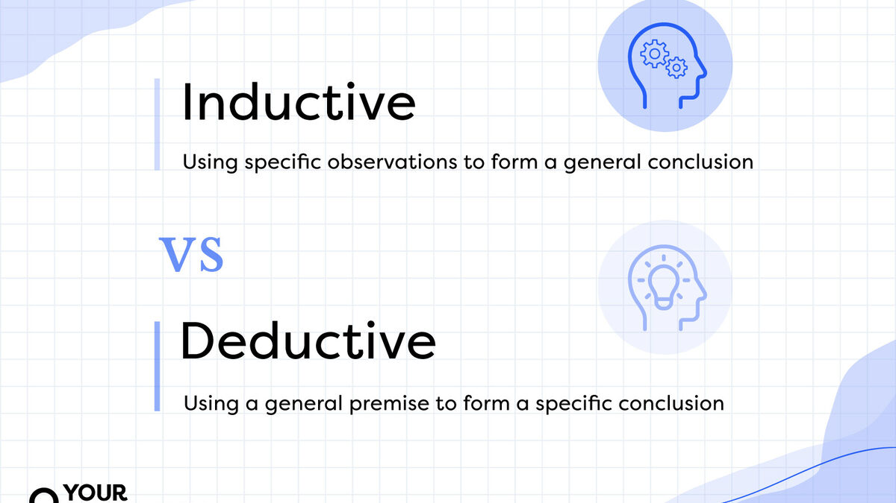
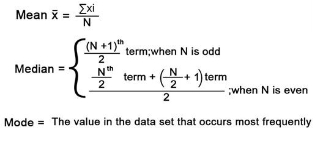

# Probability And Statistics


## Probability VS Statistics

|Probability|Statistics|
|---|---|
|Theoretical (pure math)|Applicable (applied math)|
|Deduction (Rule->Data)|Induction (Data->Rule|
|Ideal|Real|
|Certainty|Estimation|
|Predict|Summarize|
|Future|Past|

For your reference:



In summary, while probability theory deals with the mathematical study of uncertainty, statistics deals with the practical aspects of collecting, analyzing, and interpreting data. Probability provides the theoretical underpinnings for statistical methods, and statistics provides the application of probability in real-world scenarios. They complement each other and are essential tools for understanding uncertainty and making informed decisions in various fields.

## Distributions

Mean, median, mode, and range:



> Note: The sigma symbol (uppercase Σ, lowercase σ) is a letter of the Greek alphabet commonly used to indicate a summation. For example, the expression Σx represents the sum of all values of x in a series or set of data.

- **Mean**: it is the average of a data set. It can be calculated by adding up all of the numbers in the data set and then dividing by the total number of values in the set.
    ```
    Σxᵢ   (x₁ + x₂ + x₃ + x₄ + ...)
    --- = -------------------------
     N               N
    
    Where:
    N is the amount of items

    Example, data set: 1,2,3,4,5
    Mean = (1+2+3+4+5)/5 = 120/5 = 24
    ```
- **Median**: list the numbers in your dataset from the lowest value to the highest value. The median is the number that is in the middle of the list of numbers.
    ```
    When N is odd:
                Nᵗʰ
        median = --- term
                2


    When N is even:
                Nᵗʰ
        median = --- term  + (N/2 +1)ᵗʰ term
                2
    
    Example, data set: 5,6,7,8,9
    Median = 7
    ```
- **Mode**: is the value that appears the most number of times in a set of data.
    ```
    Data set: 2,5,6,6,7,7,7,7,8,9,12,12,14
    Mode = 7
    ```
- **Range**: is the difference between the largest value and the smallest value.
    ```
    Data set: 5,6,7,8,9,10,11
    range = 11-5 = 6
    ```


https://learning.oreilly.com/course/probability-and-statistics/9780137566273/

https://learning.oreilly.com/course/mastering-probability-and/9781801075091/